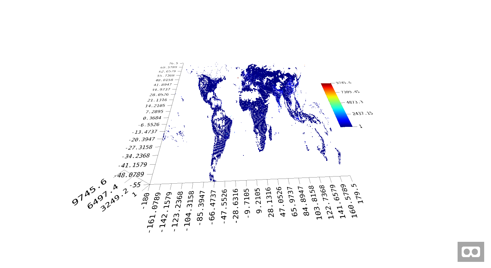

# ascatter

Virtual Reality Scatter Plot with R.


## Installation

``` r
# install.packages("devtools")
devtools::install_github("JohnCoene/ascatter")
```
## Example

``` r
library(ascatter)

data(population)

aframer::browse_aframe(
  aScatter$
    new(title = "Random")$
    build(
      population, lon, pop, lat, color, size, 
      scale = "2 2 2", valfill="1, 9745.6", 
      yLimit = 0.2, rotation = "0 90 0"
    )$
    plot()
)

```


